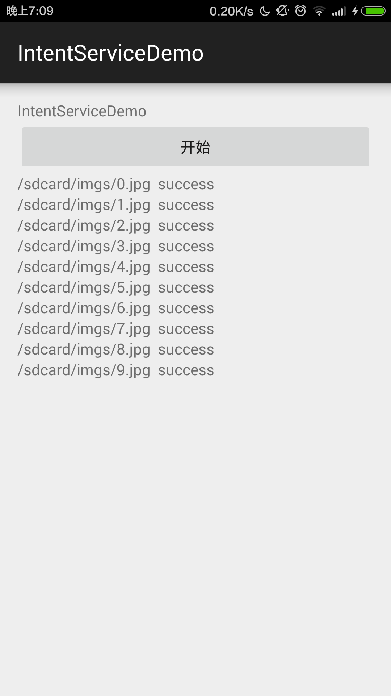

# IntentServiceDemo

>启动
```java
Intent intent=new Intent(context,UploadImgService.class);
intent.setAction(ACTION_UPLOAD_IMG);
intent.putExtra(EXTRA_IMG_PATH, path);
context.startService(intent);
```
>在实现的```onHandleIntent```方法中编写耗时操作

```java
@Override
protected void onHandleIntent(Intent intent) {
    if (intent != null) {
        String action = intent.getAction();
        if (ACTION_UPLOAD_IMG.equals(action)) {
            String path=intent.getStringExtra(EXTRA_IMG_PATH);

            try {
                Thread.sleep(2000);
                Logger.e("onHandleIntent" + path);
                EventBus.getDefault().post(new MessageEvent(path));
            } catch (InterruptedException e) {
                e.printStackTrace();
            }
        }

    }
}
```
>完整代码

```java

/**
 * Created by zsl on 15/7/30.
 */
public class UploadImgService extends IntentService {
    private static final String ACTION_UPLOAD_IMG = "com.zsl.intentservicedemo.UploadImgService.ActionUploadImg";
    private static final String EXTRA_IMG_PATH = "com.zsl.intentservicedemo.UploadImgService.ExtraImgPath";

    /**
     * 启动SerVice
     *
     * @param context
     * @param path
     */
    public static void startUPloadImg(Context context, String path) {
        Intent intent=new Intent(context,UploadImgService.class);
        intent.setAction(ACTION_UPLOAD_IMG);
        intent.putExtra(EXTRA_IMG_PATH, path);
        context.startService(intent);
    }
    public UploadImgService() {
        super("UploadImgService");
    }

    @Override
    protected void onHandleIntent(Intent intent) {
        if (intent != null) {
            String action = intent.getAction();
            if (ACTION_UPLOAD_IMG.equals(action)) {
                String path=intent.getStringExtra(EXTRA_IMG_PATH);

                try {
                    Thread.sleep(2000);
                    Logger.e("onHandleIntent" + path);
                    EventBus.getDefault().post(new MessageEvent(path));
                } catch (InterruptedException e) {
                    e.printStackTrace();
                }
            }

        }
    }

    @Override
    public void onCreate() {
        super.onCreate();
        Logger.e("UploadImgService:onCreate");
    }

    @Override
    public void onDestroy() {
        super.onDestroy();
        Logger.e("UploadImgService:onDestroy");
    }
}
```

>注意事项

- ```IntentService```也是```Service```所以必须在清单文件中注册，注册方法就是```Service```
- 结合```EventBus```使用时，要在```public void onEventMainThread(MessageEvent event)```中更新UI



[视频](device-2015-07-30-185450.mp4)


